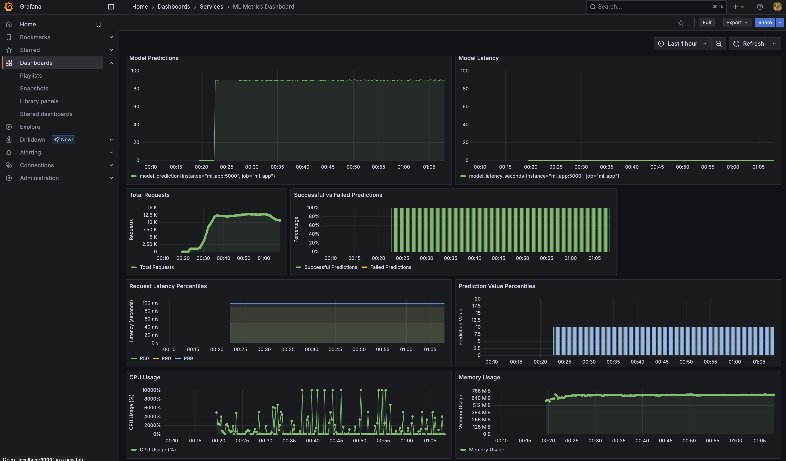

# MLOps Engineering Project

Machine Learning engineering project for models deployment to showcase front-to-back modern way of deploying and running ML models in production. 

We use simple linear regression model that was trained to predict a stock price (Exxon Mobile stock) based on Oil prices. Model training is not in scope for this project. Pre-trained model serialised and saved to be loaded into memory for service predictions.

* FastAPI service for model inference (http://localhost:5000/redoc)
* Prometheus for monitoring (http://localhost:9090)
* Grafana dashboard for monitoring metrics integration (http://localhost:3000)
* Evidently for Data/Logical drift (WIP)

* MinIO for persistent layer (TODO)
* MLFlow for model training, features store, models registry (TODO) 


Model Service API definition




## How to run

1. Build and run the containers with `docker-compose`

    ```bash
    docker compose up -d --build
    ```


### Local Development Setup

## Model Envrionment Setup and Development

### Local Development Setup and dependencies management

Python dependencies are managed by [pip-tools](https://pypi.org/project/pip-tools/). You need to create conda or venv for your env first.

pip-compile generates a requirements.txt file using the latest versions that fulfil the dependencies you specify in the supported files.

If pip-compile finds an existing requirements.txt file that fulfils the dependencies then no changes will be made, even if updates are available.

To force pip-compile to update all packages in an existing requirements.txt, run pip-compile --upgrade.


1. Prepapre Python env 

   Create conda environment from env file:

        conda env create -f environment.yml

    Alternatively, create create a virtual envrionment with 'venv'

        python3 -m venv env
        

2. Activate the environment:

        conda activate mlops

        source env/bin/activate

pip-compile requirements.in

4. Install model in editable mode for active development

        pip install -e .

5. Install as a package

        pip install

6. If a new package is added to the requirements.txt file:
   

        pip install --upgrade -r requirements.txt

7. Removing installed virtual environment

    For conda:

        conda remove --name mlops --all

    For pip env - delete associated directory

8. Updating with new dependenciespip-compile --upgrade

        pip-compile --upgrade
        
        pip install --ignore-installed -r requirements.txt

        Or

        pip install --upgrade --force-reinstall -r requirements.txt


### Local Deployment

#### Build an image
docker build . -t yevdeveloper/ml-ops:latest

#### Start a container with a given name

docker run --name=ml-ops --rm -p 5000:5000 -d yevdeveloper/ml-ops:latest

docker run --name=ml-ops -p 5000:5000 -d yevdeveloper/ml-ops:latest

docker run --name=ml-ops -d yevdeveloper/ml-ops:latest


#### Containers maintenance

* Check stdout
  ```bash
  docker logs ml-ops
  docker logs -f ml-ops
  ```

* Login running docker container
  
  ```bash
  docker exec -it yevdeveloper/ml-ops  bash
  ```

* Stopping containers
  
  ```bash
  docker stop $(docker ps -a -q)
  ```

* Removing containers
  
  ```bash
  docker rm $(docker ps -a -q)

  docker container prune
  ```

#### Testing


1. Single request
   
```bash

curl -X POST "http://127.0.0.1:8000/predict" \
-H "Content-Type: application/json" \
-d '{"data": [85]}'

```

 Or you can simulate sending a 1000 requests using the `simulate_requests.sh` script to view metrics in log file.

#### To delete all images

docker rmi $(docker images -a)

#### To delete containers which are in exited state

docker rm $(docker ps -a -f status=exited -q)

#### To delete containers which are in created state

docker rm $(docker ps -a -f status=created -q)


### Troubleshooting

#### A docker container is not starting 


```
# Lists all created containers but potentually not run containers
docker container ls --all 

docker run --rm -it --name MYCONTAINER yevdeveloper/ml-ops:latest bash

```